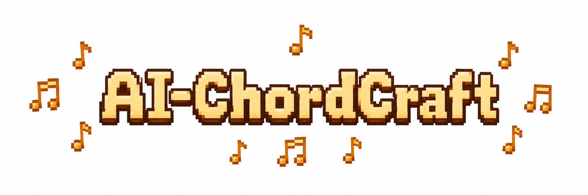
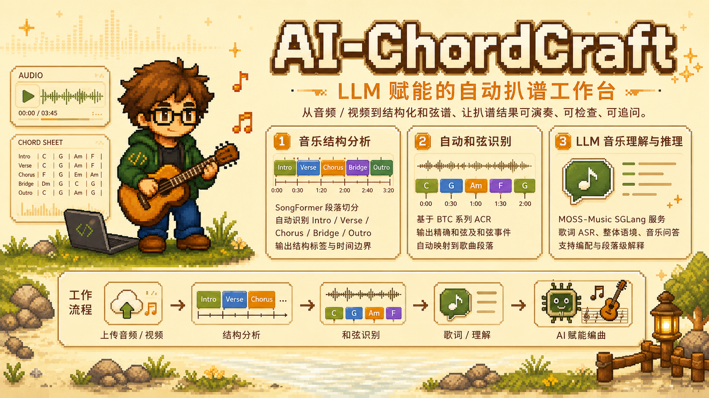

<p align="center">
  
</p>

<div align="center">


</div>

<p align="center">
  <a href="./README.md">简体中文</a> | <a href="./README_en.md">English</a>
</p>

**AI-ChordCraft** is an **LLM-enhanced automatic chord-transcription workspace**. It accepts audio or video input, extracts audio automatically, combines song-structure segmentation, key and tempo estimation, chord recognition, lyrics ASR, and large-model music understanding into one workflow, and finally renders a chord sheet in the browser.

<p align="center">
  
</p>

> **This repository is code only, and the full demo requires GPUs** for the LLM service, SongFormer, and the chord-recognition runtime. There is currently no hosted public service. If you want to get started **without a GPU**, you can try [AI-Musician-Skills](https://github.com/jassary08/AI-Musician-Skills), which focuses on turning chord progressions into playable arrangements.

### 📰 News

- 🎉 **2026.06:** AI-ChordCraft was officially open-sourced as an LLM-enhanced workspace for automatic chord transcription and interactive chord-sheet generation.

### 📚 Contents

- [Introduction](#introduction)
- [Features](#features)
- [Workflow](#workflow)
- [Quickstart](#quickstart)
- [Project Layout](#project-layout)
- [More Information](#more-information)
- [License Notes](#license-notes)
- [Citation](#citation)
- [简体中文](./README.md)

### 🎼 Introduction

AI-ChordCraft aims to strengthen traditional automatic transcription workflows with LLMs. Instead of only outputting a chord progression, it organizes structure, harmony, lyrics, key, tempo, section boundaries, and a playable timeline into a working document for performance and discussion. Users can obtain a structured chord sheet from a song, inspect each section, play local excerpts, select sections for follow-up chat with a large model, and receive arrangement-oriented guidance.

Compared with tools focused on a single MIR task, AI-ChordCraft emphasizes a full **recognition + explanation + interaction + arrangement** loop:

- 🎧 **Recognition**: extract structure, chords, key, tempo, lyrics, and other transcription information from audio or video.
- 🧠 **Explanation**: use an external LLM to explain sections, harmonic motion, overall style, and uncertain points in natural language.
- 💬 **Interaction**: select any section and ask questions such as "why is this chord here?" or "can the chorus be adapted into a guitar-friendly progression?"

The current automatic transcription workflow integrates three groups of capabilities:

- 🧱 **Music structure analysis**: calls SongFormer to segment a full song into section labels such as intro, verse, chorus, bridge, and outro with time boundaries.
- 🎹 **Automatic chord recognition**: uses a high-accuracy chord-recognition model to output timestamped chord events, then maps them to song sections.
- 🧠 **LLM music understanding and reasoning**: connects to an external LLM service through a compatible API to provide lyrics ASR, full-song description, section-level explanation, music QA, and arrangement-oriented reasoning. MOSS-Music is recommended, but other compatible services can also be used.

### ✨ Features

- 📤 **Web upload for audio / video**: supports common audio and video formats; video files are converted to audio before analysis.
- 🎼 **Structured chord-sheet generation**: displays chords, timestamps, lyrics, key, tempo, and overall information by song section.
- ▶️ **Timeline and section playback**: play the full audio or jump to individual sections for manual review.
- 💬 **LLM-powered music QA**: select sections and ask follow-up questions about harmonic motion, transcription rationale, arrangement, practice, or adaptation.

### 🔄 Workflow

AI-ChordCraft connects traditional audio-analysis modules and LLM reasoning modules into a transcription-oriented workflow:

```text
Audio / Video Upload
        |
        v
Audio Extraction and Normalization
        |
        +--> SongFormer Structure Segmentation
        |
        +--> ACR Chord Recognition
        |
        +--> External LLM Lyrics ASR
        |
        v
Section Alignment and Chord-Sheet Rendering
        |
        v
Interactive Browser UI + Music QA + Arrangement Tools
```

### 🚀 Quickstart

#### ⚙️ Environment Setup

```bash
cd AI-ChordCraft
python -m venv .venv
source .venv/bin/activate
pip install -r requirements.txt
cp .env.example .env
```

Prepare the local third-party runtime directory:

```bash
bash scripts/prepare_third_party.sh
```

The final directory layout should look like this:

```text
third_party/
  MOSS-Music/
    model/
      MOSS-Music-8B-Thinking/
      MOSS-Music-8B-Instruct/
  SongFormer/
    src/SongFormer/ckpts/SongFormer.safetensors
    src/SongFormer/configs/SongFormer.yaml
  ChordMiniApp/                       # source of the ACR runtime
  acr_model/                          # ACR runtime copy used by AI-ChordCraft
    btc_chord_recognition.py          # provided by ChordMini
    config/btc_config.yaml            # provided by ChordMini
    checkpoints/
      btc/btc_combined_best.pth       # PL weights
      SL/btc_model_large_voca.pt      # SL weights
```

If these components are stored elsewhere, you do not need to move files; update the corresponding paths in `.env`.

#### 🧠 LLM Inference Service

AI-ChordCraft usually connects to an LLM service compatible with `/generate`, configured by service URL, API key, and model name. MOSS-Music is recommended for music understanding, but other compatible services can also be used:

```env
CHORDCRAFT_SGLANG_BASE_URL=http://127.0.0.1:30000
CHORDCRAFT_SGLANG_API_KEY=your-api-key
CHORDCRAFT_SGLANG_MODEL_NAME=your-model-name
```

`CHORDCRAFT_SGLANG_BASE_URL` is the unified LLM address. By default, all text-generation tasks use this endpoint. `CHORDCRAFT_SGLANG_API_KEY` is sent as a Bearer token and can be left empty for unauthenticated local services. `CHORDCRAFT_SGLANG_MODEL_NAME` is sent as the request `model` field for OpenAI-compatible or router-style services; leave it empty if your local `/generate` endpoint already binds to a fixed model.

For local MOSS-Music + SGLang, install the upstream runtime dependencies first, then start one local service:

```bash
bash scripts/start_llm_sglang.sh
```

The script starts the model pointed to by `CHORDCRAFT_SGLANG_INSTRUCT_MODEL_PATH` on port `30000` by default. Dual-model variables remain backward-compatible, but dual deployment is no longer the default. This script is optional; hosted OpenAI-compatible services only need the URL, API key, and model name above.

#### 🧱 SongFormer Structure Service

Structure segmentation uses SongFormer by default. Start the SongFormer service separately and configure its address in `.env`:

```env
CHORDCRAFT_SONGFORMER_BASE_URL=http://127.0.0.1:8080
CHORDCRAFT_SONGFORMER_TIMEOUT=900
```

AI-ChordCraft uploads the audio file to:

```text
POST ${CHORDCRAFT_SONGFORMER_BASE_URL}/api/songformer/segment
```

After cloning SongFormer and placing its checkpoint/config files, you can start the structure service expected by AI-ChordCraft:

```bash
bash scripts/start_songformer_service.sh
```

You can also use the in-process SongFormer runtime by setting `structure_engine=songformer-local` and specifying the SongFormer root and model files:

```env
CHORDCRAFT_SONGFORMER_ROOT=./third_party/SongFormer
SONGFORMER_MODEL_NAME=SongFormer
SONGFORMER_CHECKPOINT=src/SongFormer/ckpts/SongFormer.safetensors
SONGFORMER_CONFIG=src/SongFormer/configs/SongFormer.yaml
```

#### 🌐 Run the Web App

```bash
bash scripts/run_demo.sh
```

Open:

```text
http://127.0.0.1:7862
```

### 🗂️ Project Layout

```text
AI-ChordCraft/
  app.py                  # FastAPI web service
  frontend/               # Browser UI
  third_party/README.md   # Local runtime layout; upstream code/checkpoints are ignored
  src/
    song_analysis.py      # Main analysis workflow and chord-sheet rendering
    chat_agent.py         # Follow-up music QA and prompt strategy
    chord_recognition.py  # Automatic chord recognition, Essentia-style helpers, postprocessing
    structure_recognition.py
    arrangement.py        # Arrangement-agent workflow
  scripts/
    prepare_third_party.sh
    start_llm_sglang.sh
    start_songformer_service.sh
    run_demo.sh
  requirements.txt
```

### 🔗 More Information

- **AI-Musician-Skills**: [https://github.com/jassary08/AI-Musician-Skills](https://github.com/jassary08/AI-Musician-Skills)
- **MOSS-Music**: [https://github.com/OpenMOSS/MOSS-Music](https://github.com/OpenMOSS/MOSS-Music)
- **Automatic Chord Recognition paper**: [https://arxiv.org/abs/2602.19778](https://arxiv.org/abs/2602.19778)
- **SongFormer paper**: [https://arxiv.org/abs/2510.02797](https://arxiv.org/abs/2510.02797)

### 📄 License Notes

Before release or redistribution, check the licenses of this repository's code, external model weights, external runtimes, dependencies, and example music separately. Do not distribute third-party checkpoints or copyrighted music with this repository unless their licenses explicitly allow it.

### 📝 Citation

If you use AI-ChordCraft in research or applications, please cite this project and the upstream models or methods you actually use:

```bibtex
@misc{aichordcraft2026,
      title={AI-ChordCraft: An LLM-Enhanced Workspace for Automatic Chord Transcription and Music QA},
      author={jassary08},
      year={2026},
      howpublished={\url{https://github.com/jassary08/AI-ChordCraft}},
      note={Open-source software project; no associated paper}
}
```

```bibtex
@misc{mossmusic2026,
      title={MOSS-Music Technical Report},
      author={OpenMOSS Team},
      year={2026},
      howpublished={\url{https://github.com/OpenMOSS/MOSS-Music}},
      note={GitHub repository}
}
```

```bibtex
@misc{hao2026songformerscalingmusicstructure,
      title={SongFormer: Scaling Music Structure Analysis with Heterogeneous Supervision},
      author={Chunbo Hao and Ruibin Yuan and Jixun Yao and Qixin Deng and Xinyi Bai and Yanbo Wang and Wei Xue and Lei Xie},
      year={2026},
      eprint={2510.02797},
      archivePrefix={arXiv},
      primaryClass={eess.AS},
      url={https://arxiv.org/abs/2510.02797},
}
```

```bibtex
@misc{phan2026enhancingautomaticchordrecognition,
      title={Enhancing Automatic Chord Recognition via Pseudo-Labeling and Knowledge Distillation},
      author={Nghia Phan and Rong Jin and Gang Liu and Xiao Dong},
      year={2026},
      eprint={2602.19778},
      archivePrefix={arXiv},
      primaryClass={cs.SD},
      url={https://arxiv.org/abs/2602.19778},
}
```
